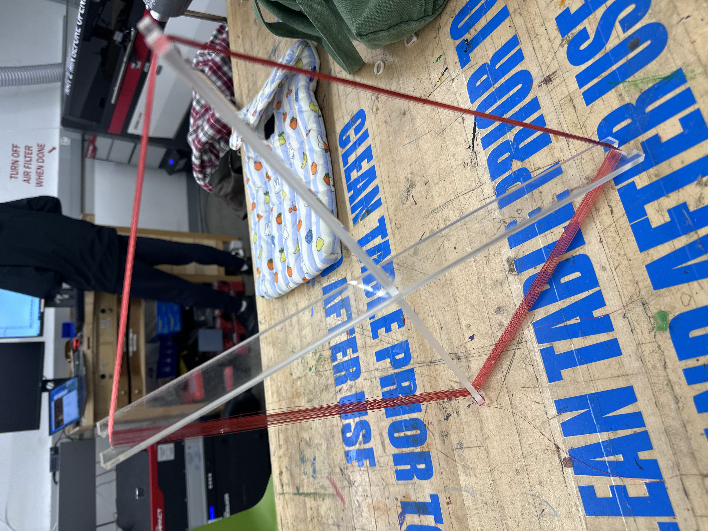
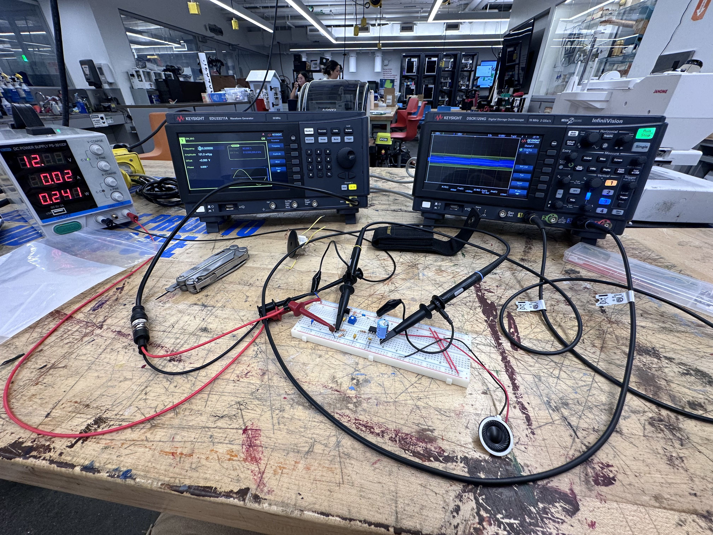

# AM-Radio-Receiver

This is where I will be tracking progress of my AM radio receiver project with schematics and pictures.

As it stands, the design uses a 350uH magnetic loop antenna I wound myself on a frame made out of 6mm acrylic. I have never made a radio receiver before so I used [this tutorial](https://www.circuitbasics.com/what-are-am-radios/) as a general guide, and the [Electron Bunker bandspread calculator](https://electronbunker.ca/eb/BandspreadCalc.html) to get the right tuning for the capacitors in my detector circuit based on available variable capacitor values.

## Project Photos

### Loop Antenna

### Amplifier Testing

